# Schema.org, Drupal and the Future of SEO

---

## Hi! I'm...

* Nick Grace, front end development manager at [JBS International, Inc.](http://www.jbsinternational.com) I'm [@nickgrace](https://twitter.com/nickgrace) just about everywhere.

* Mike Nescot, web operations manager at [JBS International, Inc.](http://www.jbsinternational.com) I'm [@mnescot](https://twitter.com/mnescot) just about everywhere.

---

## JBS International, Inc.


---

## Agenda

* History of SEO
* Rich Snippets
* Google's Knowledge Graph
* Schema.org Module

---

# History of SEO

---

## Apr 1993: Mosaic 1.0

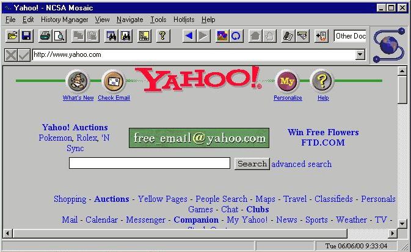

---

## Apr 1994: Yahoo & Search Engine Submission

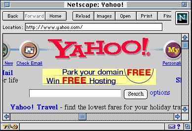

---

## Aug 1995: Internet Explorer 1

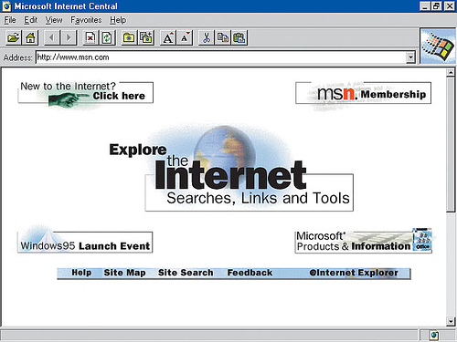

---

## Dec 1995: Altavista & On-Page SEO

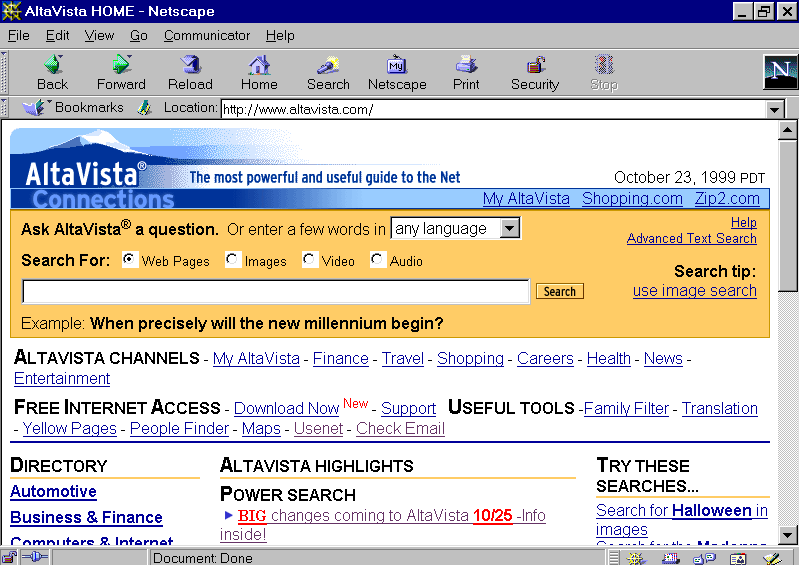

---

## Sep 1998: Google Launches

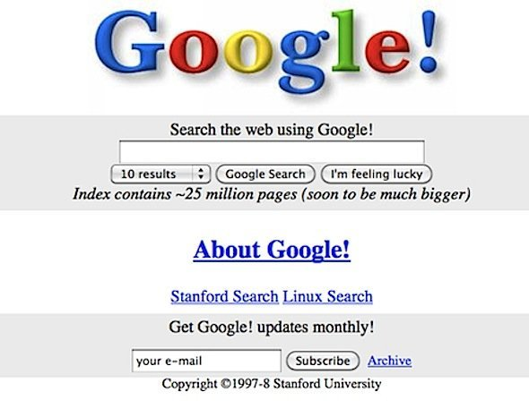

---

## Dec 2000: Google PageRank

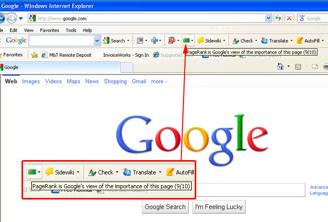

---

## Mar 2003: Google AdSense

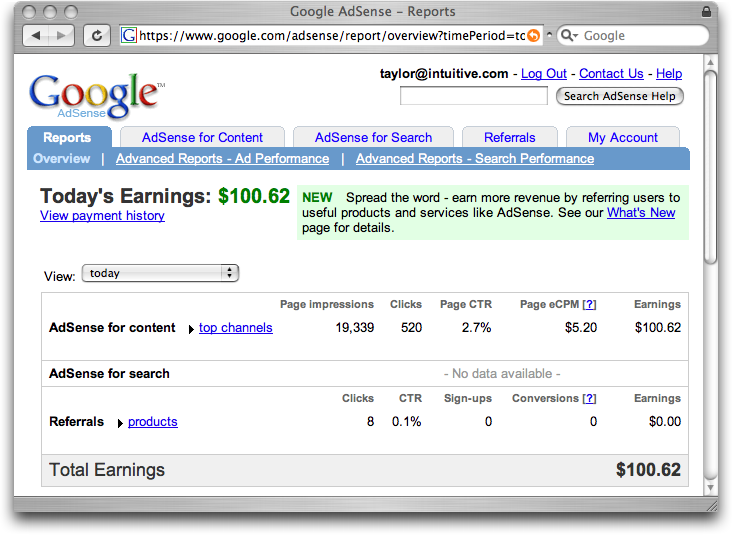

---

## Made for AdSense


---

## Made for AdSense

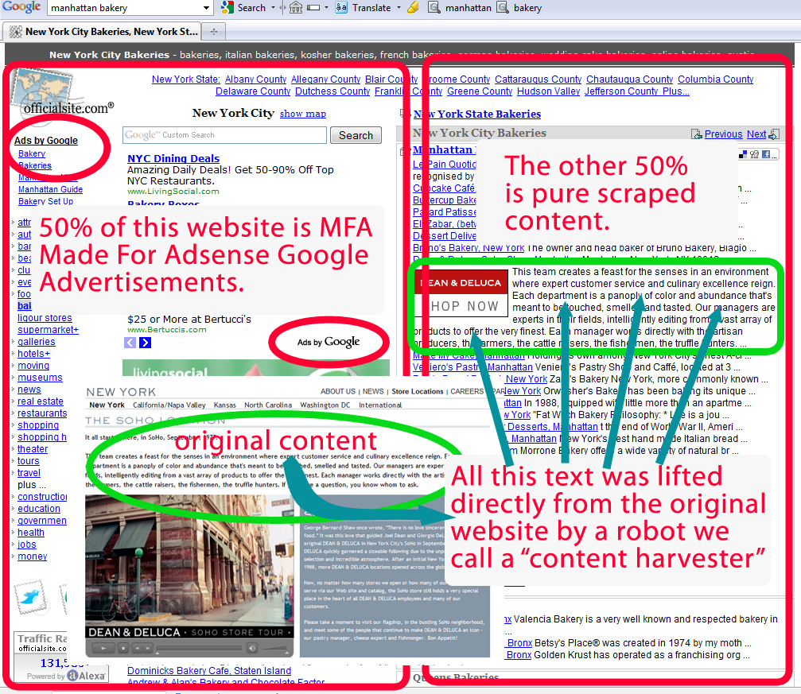

---

## Sep 2003: Florida Update & Death to Keyword Stuffing

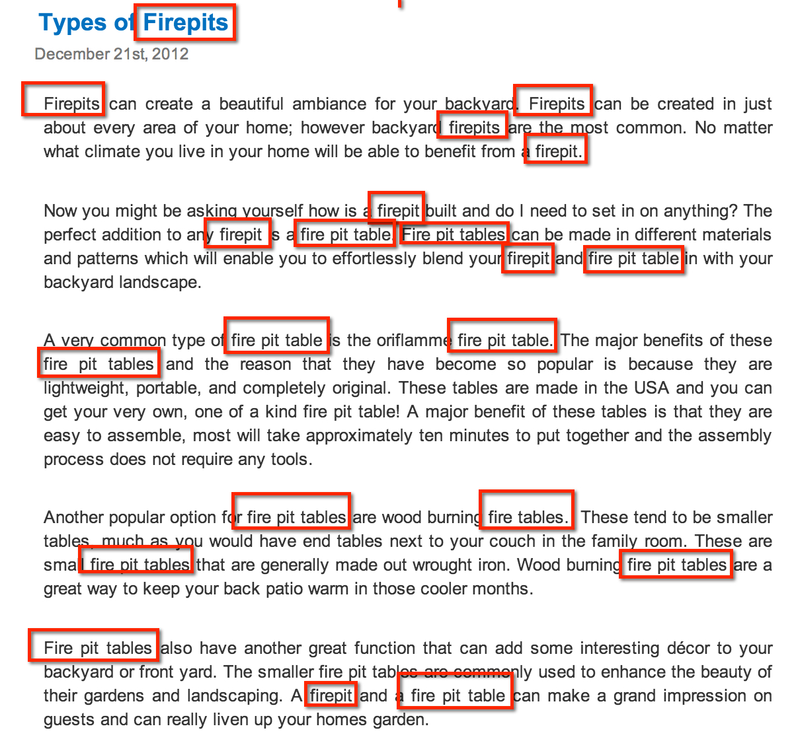

---

## Nov 2005: Jagger & Big Daddy Updates (Trustability of Links)


---

## Jul 2007: Universal Search

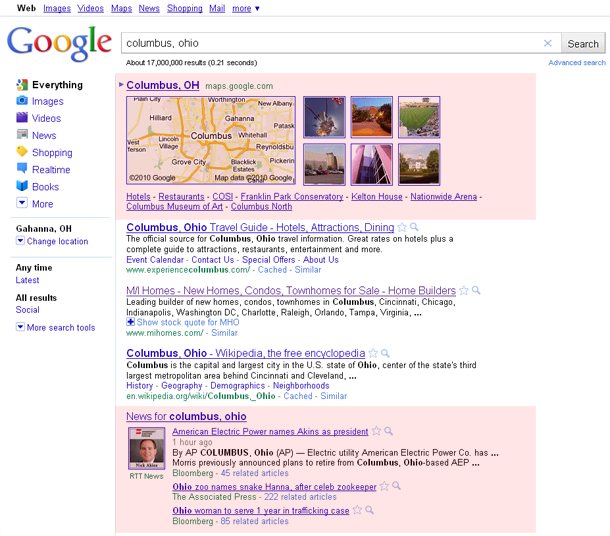

---

## Feb 2011: Panda Algorithm & Death to Content Farms

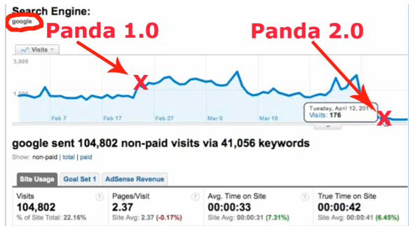

Established the power of content

---

## Content Farms

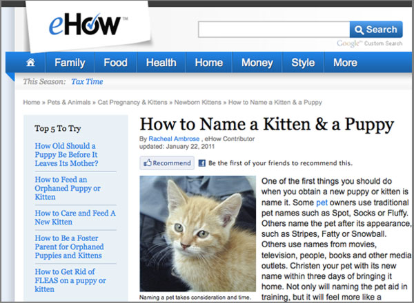

---

## May 2012: Knowledge Graph

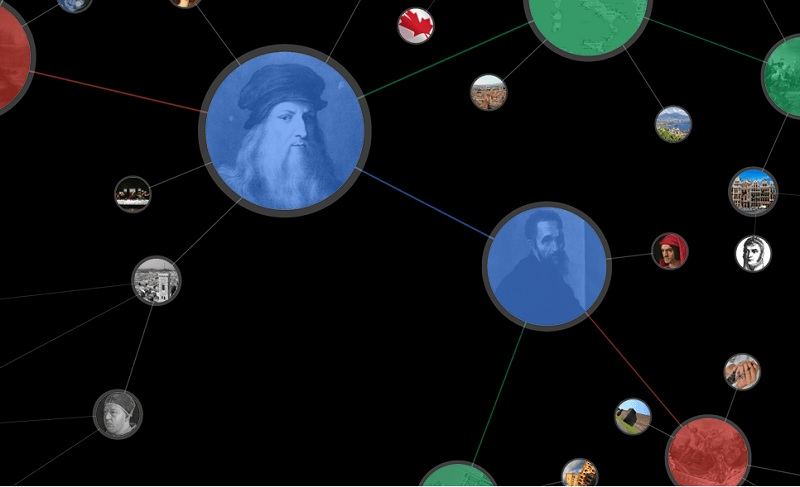

---

## Aug 2013: Hummingbird Algorithm

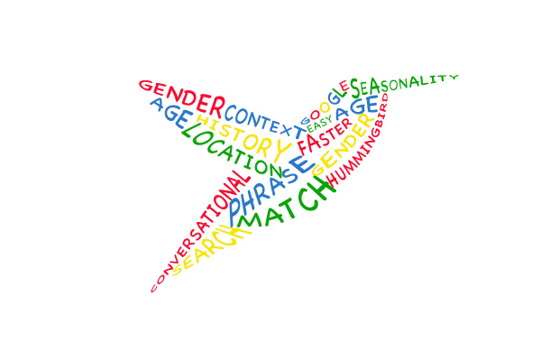

Context, Semantics, Conversational Search

---

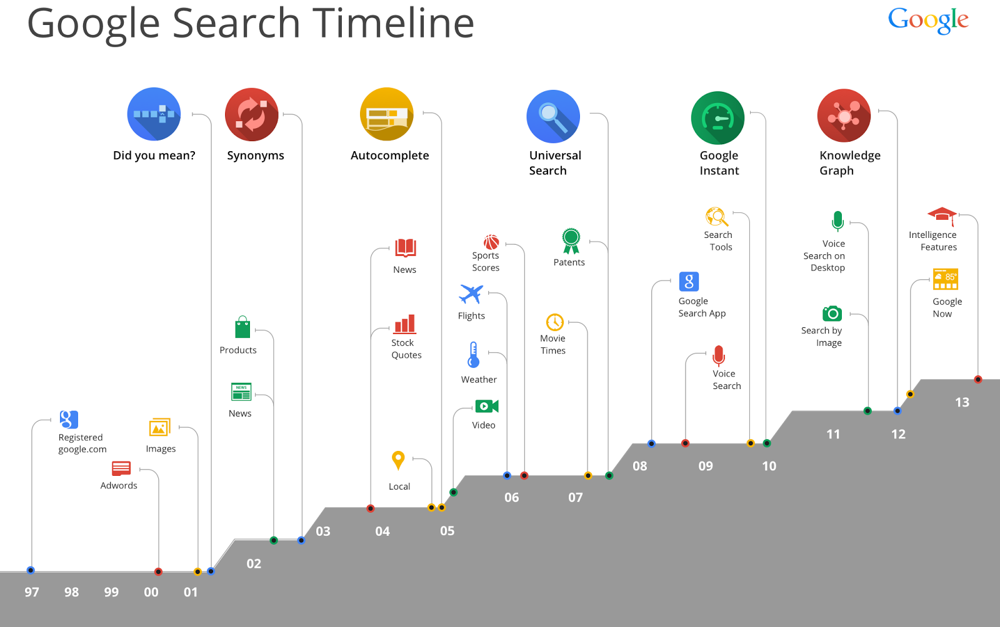

http://googleitalia.blogspot.com/2013_09_01_archive.html

---

# Rich Snippets

---

## Rich Snippets

Three syntaxes for embedding semantic data on Web:

* Microdata
* Microformats
* RDFa

---

## Rich Snippets: Microdata

```
<div itemscope itemtype="http://data-vocabulary.org/Person"> 
  My name is <span itemprop="name">Mike Nescot</span> 
  but people call me <span itemprop="nickname">Mike</span>. 
  I live in Washington, DC and work as <span itemprop="title">Web Operations Manager</span>
  for <span itemprop="affiliation">JBS International, Inc.</span>.
</div>
```

---

## Rich Snippets: Microformats (hcard)

```
<div class="vcard">
   <strong class="fn">Mike Nescot</strong>
   <span class="title">Web Operations Manager</span> at 
   <span class="org">JBS International, Inc.</span>
   <span class="adr">
      <span class="street-address">5515 Security Lane, Suite 800</span>
      <span class="locality">North Bethesda</span>, 
      <span class="region">MD</span>
      <span class="postal-code">20852</span>
   </span>
</div> 
```

---

## Rich Snippets: RDFa

```
<div xmlns:v="http://rdf.data-vocabulary.org/#" typeof="v:Person">
  My name is <span property="v:name">Mike Nescot</span>, 
  but people call me <span property="v:nickname">Mike</span>.
  I live in Washington, DC and work as 
  <span property="v:title">Web Operations Manager</span>
  for <span property="v:affiliation">JBS International, Inc.</span>.
</div>
```

---

## schema.org

* Microdata vocabulary

* Type hierarchy (top-level thing and data types)

* Mappings to Web data vocabularies, including: DBpedia, Dublin Core, FOAF, Good Relations, SIOC, BIBO, WordNet. See: http://schema.rdfs.org/mappings.html

---

## schema.org

* Collaboration by Google, Microsoft, and Yahoo! to create a common vocabulary for describing the data on the Web.

* 570 million objects and more than 18 billion facts.

* Used by over 1,000 sites.

---

## Web sites using Microdata

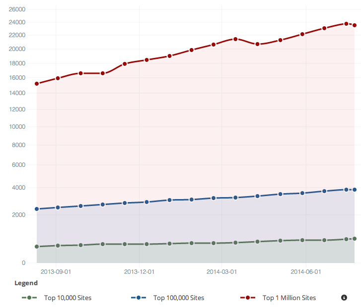

http://trends.builtwith.com/docinfo/Microdata

---

## schema.org & Google

* Google currently supports rich snippets for people, places, events, reviews, products, recipes, and breadcrumb navigation.

* New schema entities to be utilized include job listings and medical trials.

---

## schema.org: Person

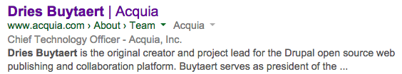

```
<div itemscope itemtype="http://schema.org/Person">
  <span itemprop="name">Dries Buytaert</span>
  <span itemprop="jobTitle">Chief Technology Officer</span>
  <span itemprop="schema:affiliation">Acquia, Inc.</span>
</div>
```

---

## schema.org: Event

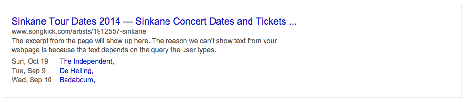

```
<div itemscope itemtype="http://schema.org/Event">
  <div itemprop="name">Sinkane</div>
  Event date:
  <time itemprop="startDate" datetime="2014-09-09T20:15:00+0200">May 8, 7:30pm</time>
  <p class="location" itemprop="location" itemscope="" itemtype="http://schema.org/Place">
  	<span itemprop="name" class="venue-name"><a href="/venues/560151-de-helling" itemprop="url">De Helling</a>,</span>
  	Utrecht, Netherlands
    <span itemprop="geo" itemscope="" itemtype="http://schema.org/GeoCoordinates">
    <meta itemprop="latitude" content="52.0768309">
    <meta itemprop="longitude" content="5.1217635">
    </span>
  </p>
</div>
```

---

## Knowledge Graph

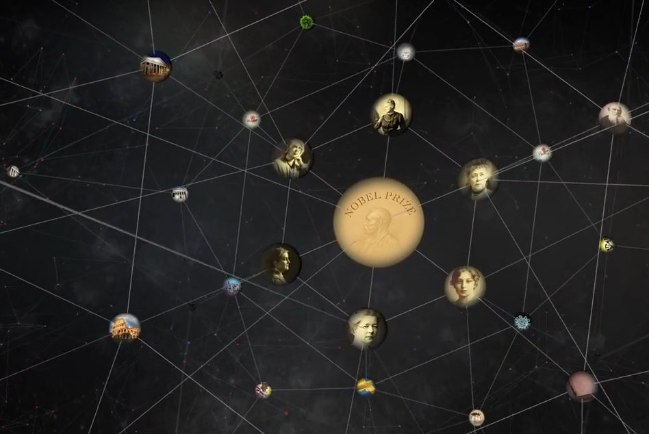

---

## Knowledge Graph: People

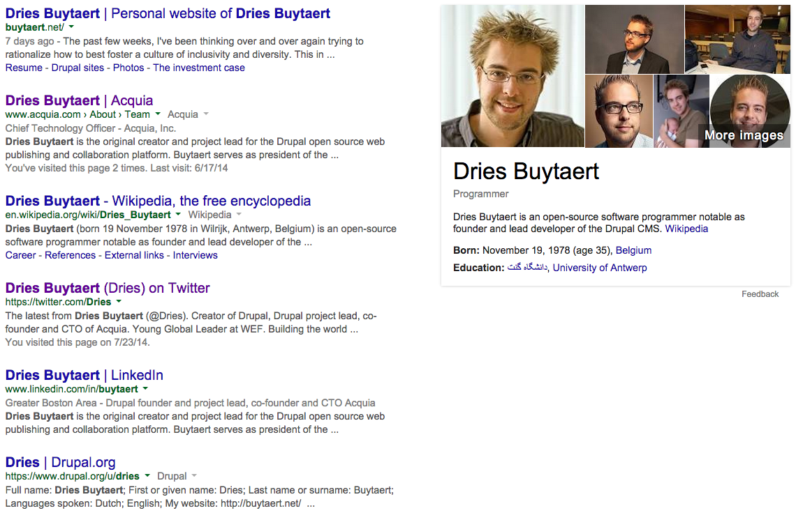

---

## Knowledge Graph: Places

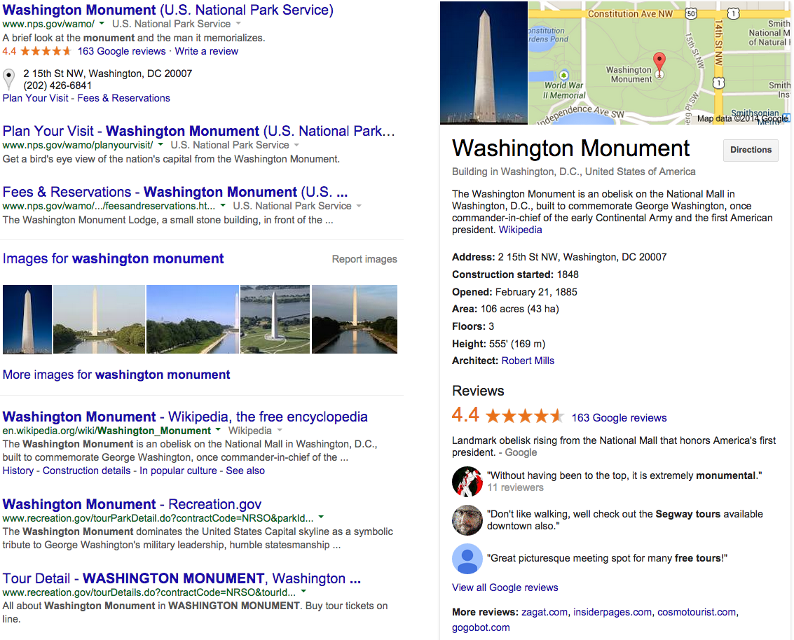

---

## Knowledge Graph: Recipes

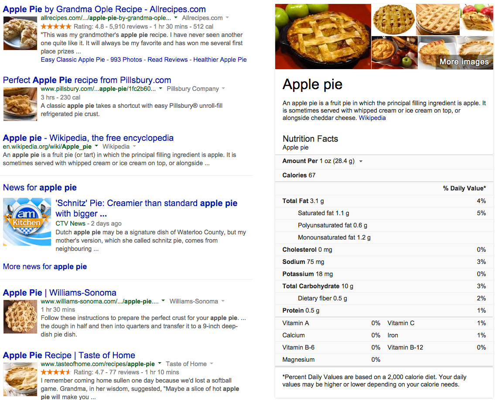

---

## Knowledge Graph: Products

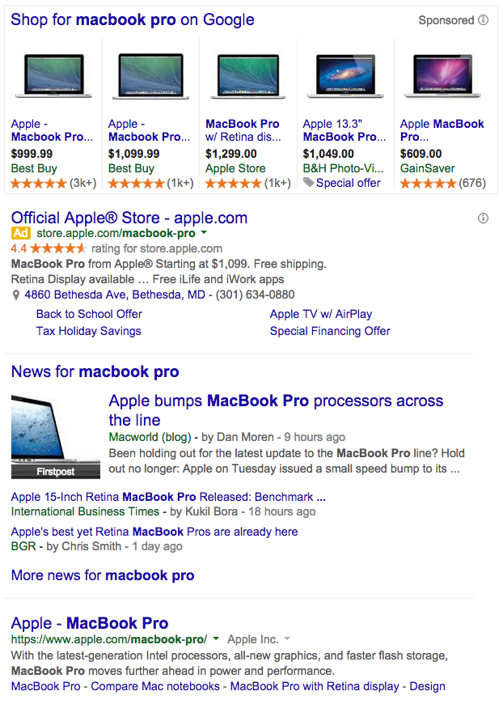

---

## Knowledge Graph: Music

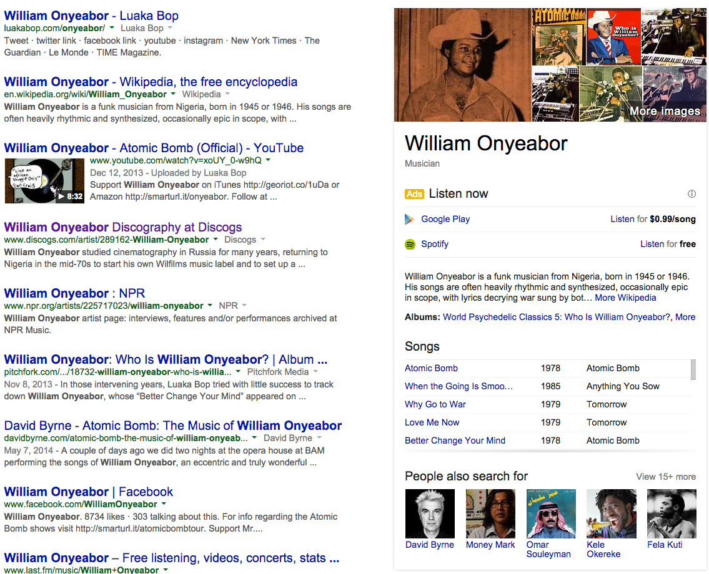

---

## Knowledge Graph: Businesses

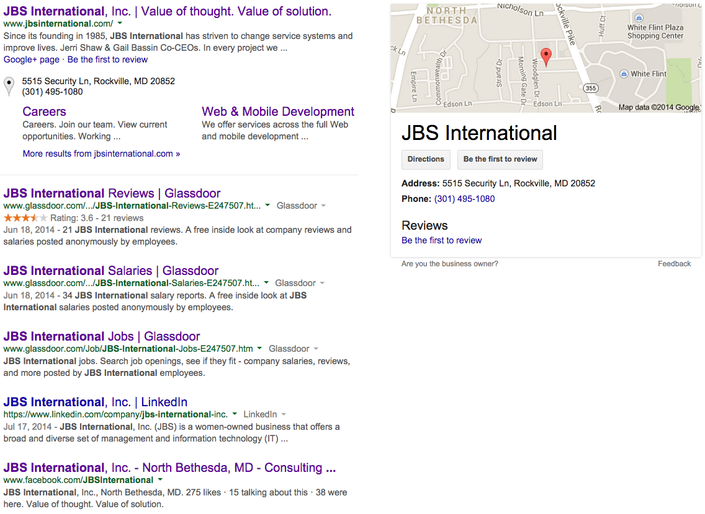

---

## Knowledge Graph: Events

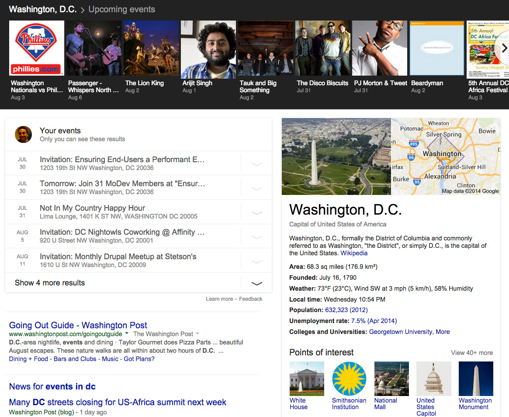

---

## Knowledge Graph: Timeline (beta)

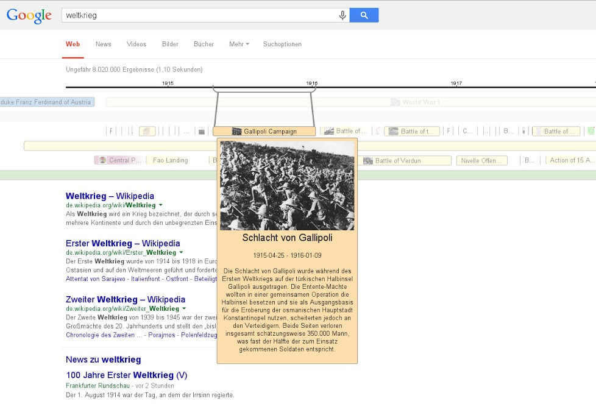

https://plus.google.com/+FlorianKiersch/posts/Eryy2punSVF

---

## Knowledge Graph: Timeline (beta)

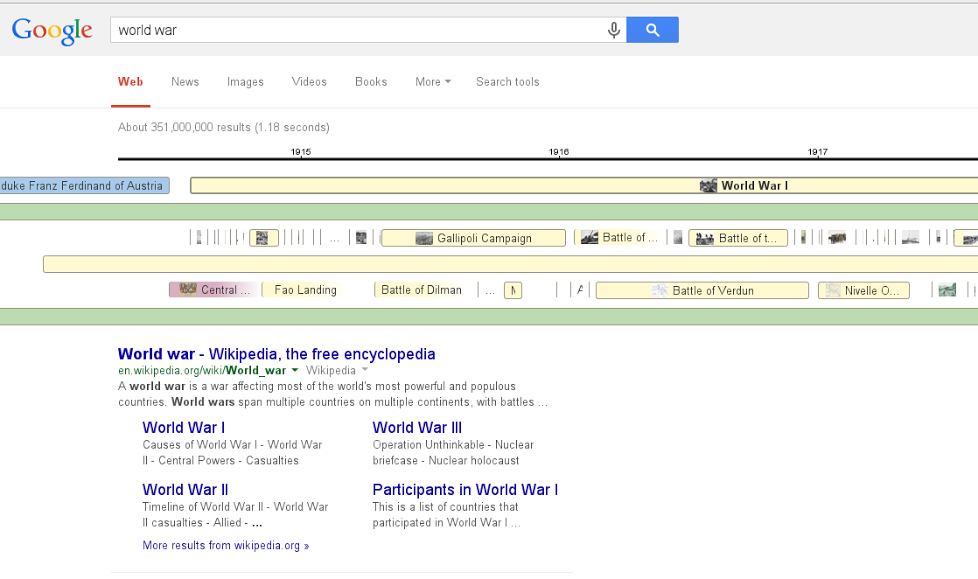

https://plus.google.com/+FlorianKiersch/posts/Eryy2punSVF

---

# schema.org Drupal Module

---

## schema.org Module

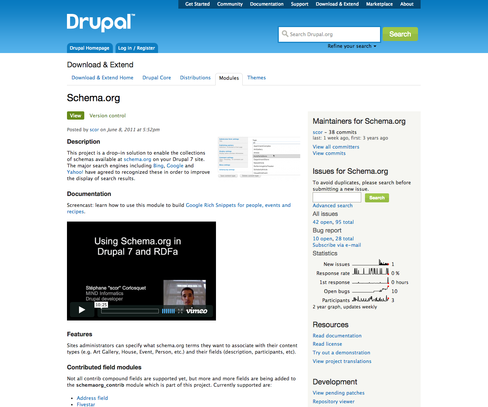

https://www.drupal.org/project/schemaorg

---

## schema.org Module

Screen

---

## State of schema.org in Drupal 8

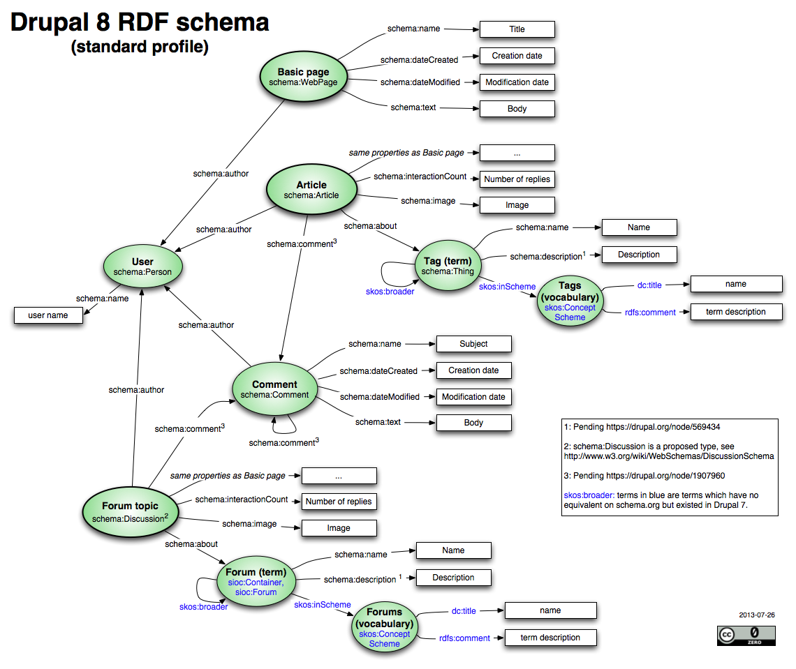

https://groups.drupal.org/node/309513

---

## Resources

[Google Structured Data Testing Tool](http://www.google.com/webmasters/tools/richsnippets)

[Structured Data Markup Helper](https://www.google.com/webmasters/markup-helper/u/0/)

[Schema.org Drupal Module](https://www.drupal.org/project/schemaorg)

[Schema.org Drupal Module Tutorial](https://www.drupal.org/node/1194024)


