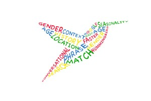

# Schema.org, Drupal and the Future of SEO

---

## Hi! I'm...

* Nick Grace, front end development manager at [JBS International, Inc.](http://www.jbsinternational.com) I'm [@nickgrace](https://twitter.com/nickgrace) just about everywhere.

* Mike Nescot, web operations manager at [JBS International, Inc.](http://www.jbsinternational.com) I'm [@mnescot](https://twitter.com/mnescot) just about everywhere.

---

## JBS International, Inc.

---

## Agenda

* History of SEO
* Google's Knowledge Graph
* Google Rich Snippets
* Schema.org Module

---

# History of SEO

---

## Apr 1993: Mosaic 1.0

---

## Apr 1994: Yahoo & Search Engine Submission

---

## Aug 1995: Internet Explorer 1

---

## Dec 1995: Altavista & On-Page SEO

---

## Sep 1998: Google Launches

---

## Dec 2000: Google PageRank

---

## Mar 2003: Google AdSense

---

## Made for AdSense

---

## Made for AdSense

---

## Content Farms

---

## Sep 2003: Florida Update & Death to Keyword Stuffing

---

## Nov 2005: Jagger & Big Daddy Updates (Trustability of Links)

---

## Jul 2007: Universal Search

---

## Feb 2011: Panda Algorithm & Death to Content Farms

Established the power of content

---

## Aug 2013: Hummingbird Algorithm

Context, Semantics, Conversational Search

---

http://googleitalia.blogspot.com/2013_09_01_archive.html

---

## Knowledge Graph

---

## schema.org

* Collaboration by Google, Microsoft, and Yahoo! to create a common vocabulary for describing the data on the Web.

* Google currently supports rich snippets for people, events, reviews, products, recipes, and breadcrumb navigation.

---

## schema.org

---

## Google Rich Snippets

---

## schema.org Module

---

## State of schema.org in Drupal 8

https://groups.drupal.org/node/309513

---

